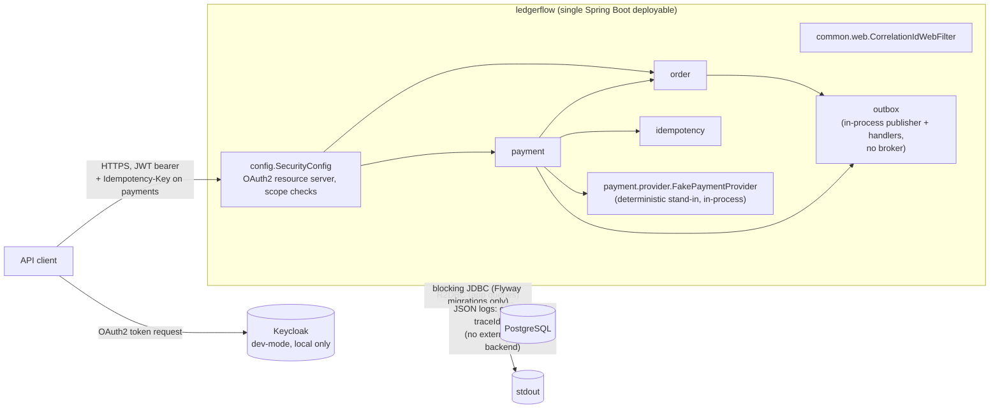

# Architecture

Diagrams for the `ledgerflow` modular monolith described in the main
[README](../README.md). See [Module layout](../README.md#module-layout) for
the package structure these diagrams summarize.

## Context and containers



Notes, each verified against the current code:

- `order`, `payment` and `idempotency` never talk to each other's
  repositories directly; `payment.service.PaymentService` depends on
  `order.service.OrderService` and `outbox.service.OutboxService`, and
  `payment.api.PaymentController` depends on
  `idempotency.service.IdempotencyService` — see [Module
  layout](../README.md#module-layout) for the full dependency list enforced
  by `ModularityArchitectureTest`.
- There is no message broker between `outbox` and its consumers: the only
  registered `OutboxEventHandler`s run in-process, in the same JVM, as
  described in [Events and reliable
  publication](../README.md#events-and-reliable-publication).
- There is no tracing backend (Tempo/Zipkin/Jaeger) and no metrics backend
  other than the in-process `/actuator/prometheus` endpoint — see
  [Observability](../README.md#observability). `docker-compose.yml` runs
  only PostgreSQL and Keycloak.

## Order create → payment authorize → outbox publish → consume

```mermaid
sequenceDiagram
    actor Client
    participant OrderCtrl as OrderController
    participant OrderSvc as OrderService
    participant PaymentCtrl as PaymentController
    participant IdemSvc as IdempotencyService
    participant PaymentSvc as PaymentService
    participant Resilience as TimeLimiter/Retry/CircuitBreaker
    participant Provider as FakePaymentProvider
    participant DB as PostgreSQL
    participant Scheduler as OutboxPublisherScheduler
    participant Dispatcher as OutboxEventDispatcher
    participant Handler as PaymentAuthorizedReceiptHandler

    Client->>OrderCtrl: POST /api/v1/orders
    OrderCtrl->>OrderSvc: create(request, customerId)
    OrderSvc->>DB: insert orders + order_items,\nappend OrderCreatedEvent (same transaction)
    DB-->>OrderSvc: committed
    OrderSvc-->>OrderCtrl: OrderEntity (CREATED)
    OrderCtrl-->>Client: 201 Created

    Note over OrderSvc,DB: Driving the order to PAYMENT_PENDING is not<br/>exposed over the API yet (see "Explicitly out of<br/>scope"); assumed done before the next step.

    Client->>PaymentCtrl: POST /api/v1/payments\n(Idempotency-Key header)
    PaymentCtrl->>IdemSvc: execute(customerId, key, request, action)
    IdemSvc->>DB: claim idempotency_keys row (insert)
    IdemSvc->>PaymentSvc: authorize(orderId, outcome, customerId)
    PaymentSvc->>OrderSvc: get(orderId, customerId)
    OrderSvc-->>PaymentSvc: OrderEntity (PAYMENT_PENDING)
    PaymentSvc->>DB: insert payments row (PENDING)
    PaymentSvc->>Resilience: settle(payment, order, outcome)
    Resilience->>Provider: authorize(payment, outcome)
    Provider-->>Resilience: AUTHORIZED
    Resilience-->>PaymentSvc: AUTHORIZED
    PaymentSvc->>DB: update payments row (AUTHORIZED),\nupdate orders row (CONFIRMED),\nappend PaymentAuthorizedEvent\n(same transaction)
    DB-->>PaymentSvc: committed
    PaymentSvc-->>IdemSvc: PaymentEntity
    IdemSvc->>DB: mark idempotency_keys row COMPLETED\n(serialized response)
    IdemSvc-->>PaymentCtrl: 201 Created body
    PaymentCtrl-->>Client: 201 Created

    Note over Scheduler,Handler: Asynchronous, on the next poll —<br/>independent of the request above.

    Scheduler->>Dispatcher: publishPendingBatch()
    Dispatcher->>DB: findPendingBatch (status = PENDING)
    DB-->>Dispatcher: PaymentAuthorizedEvent row
    Dispatcher->>DB: claim (handler_name, event_id)\nin outbox_consumed_events
    Dispatcher->>Handler: handle(event)
    Handler->>DB: insert outbox_event_receipts row\n(same transaction as the claim)
    Dispatcher-->>Scheduler: dispatch complete
    Scheduler->>DB: markPublished(event) — status = PUBLISHED
```

This diagram shows the happy path only. See [Resilience](../README.md#resilience)
for the `DECLINE`/`TIMEOUT`/circuit-breaker-open paths, and [Events and
reliable publication](../README.md#events-and-reliable-publication) for
retry/failure handling on the publisher side.
